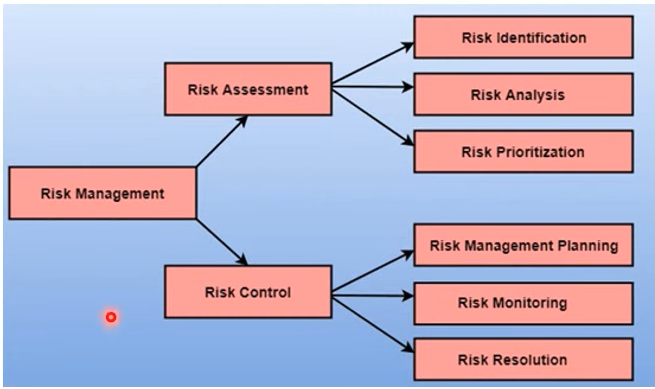

# Risk Management

## What is Risk?
> "Risk is an uncertain future event with a probability of occurrence and potential for loss."

## Source of Risk:
- Misunderstanding of customer requirements.
- Uncontrolled & continuous changing of customer requirements.
- Unrealistic promises given to the customers.
- Misunderstanding of the real impact of new methodologies.
- Miscalculation of robustness & extensibility of software design.
- Miscalculation of teamwork & group effectiveness.
- Wrong budget estimation.

## Risk Management
- Risk Management is an important part of project planning activities.
- It involves identifying and estimating the probability of risks with their order of impact on the project.

## Risk Identification
- The project organizer needs to identify risks as early as possible to reduce their impact through effective risk management planning.
- Techniques for risk identification: Brainstorming, SWOT Analysis, Causal Mapping & Flowchart methods.

### Types of Risks:
- **Technology Risks**: Software or hardware technologies used to develop the system.
- **People Risks**: Risks associated with development team members.
- **Organizational Risks**: Risks from the organizational environment.
- **Tools Risks**: Risks related to software tools and support software.
- **Requirement Risks**: Changes to customer requirements & managing requirement changes.
- **Estimation Risks**: Mismanagement of estimation resources required to build the system.

## Risk Analysis & Projection (Prioritization)
### Risk Analysis Process:
1. Identifying problems causing risks in projects.
2. Estimating the probability of occurrence.
3. Assessing the impact of the problem.

### Probability Categorization:
- **Very Low (0-10%)**: Tolerable Risk (No harm)
- **Low (10-25%)**: Low Risk (Minor effect)
- **Moderate (25-50%)**: Medium Risk (Impact on Time)
- **High (50-75%)**: High Risk (Impact on Time & Budget)
- **Very High (+75%)**: Intolerable Risk (Impact on Output, Time, Budget & Performance)

## Risk Control
### 1. Risk Planning:
- Developing strategies to mitigate identified risks.
- **Methods of Risk Planning:**
  - **Avoid the risk**: Changing requirements, reducing scope, offering incentives.
  - **Transfer the risk**: Buying insurance, outsourcing risky components.
  - **Risk reduction**: Preparing mitigation strategies, e.g., planning recruitment in case of personnel loss.

### 2. Risk Monitoring:
- Ongoing process throughout the project.
- Continuous evaluation and reassessment of potential risks.
- Identifying changes in assumptions and taking necessary actions.

### 3. Risk Resolution:
- Ensuring the project stays on track and risks remain controlled.
- Effectiveness depends on accurate risk identification, analysis, and planning.
- Ability to respond promptly to issues that arise during the project.

---

*This document provides a structured overview of risk management, helping teams effectively identify, analyze, and control risks in project management.*
